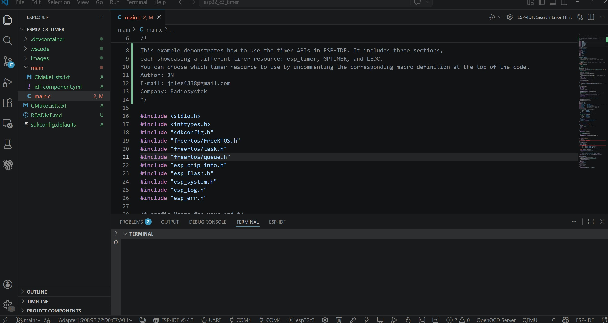
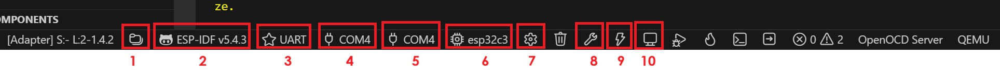
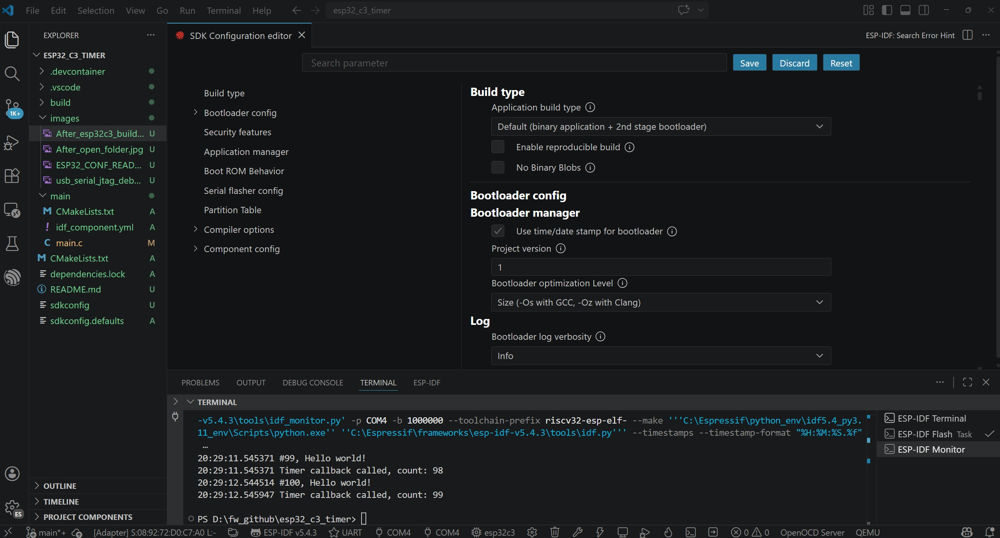
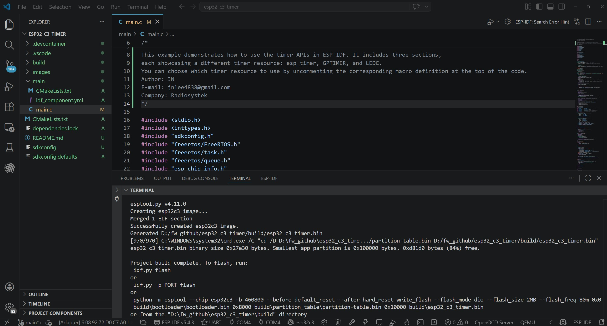
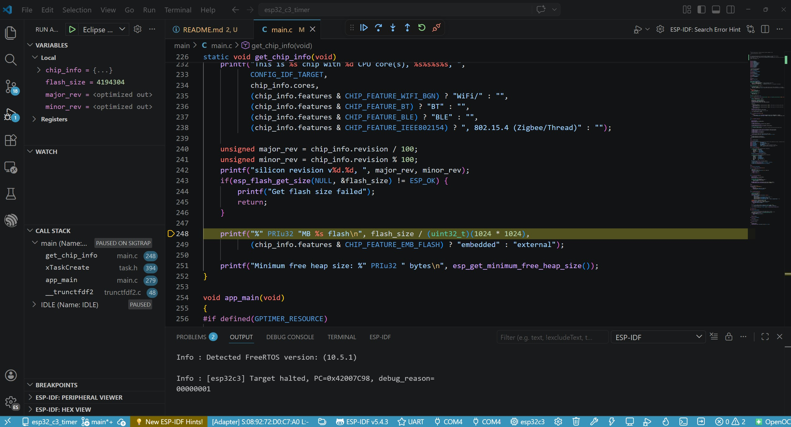

# ESP32 C3 Periodic LED blinking + LEDC + gptimer + esp-timer + USB Serial/Jtag example

It's a simple demonstation of LED blink in ESP32-C3. and There are three different ways to implement periodic LED blinking from LEDC, gptimer, esp-timer.

As there is no usb-uart bridge circuit in **this tiny gateway board**, it uses the builtin native USB from ESP32-C3 (GPIO18: D-) (GPIO19: D+). thus it uses usb-serial-jtag. it is better than one which has a usb to uart bridge circuit. you don't need to press the boot and reset buttons manually as well.

## Preparation

We are going to use ESP-IDF version 5.4.3 in this project, you should install and set up your own IDE, toolchain, etc. and the demo environment is Windows 11 & VS Code.

* Prepare any ESP32 C3 dev kit.

* You'd better install Python & Git before installing the followings in case your OS is Windows.

* Install ESP-IDF tool & toolchain -- I recommend ["esp-idf-tools-setup-online-2.x.x"](https://dl.espressif.com/dl/esp-idf/) if your OS is Windows. others still make errors.

* Install VS CODE and find out "ESP-IDF extention" in EXTENTIONS. then, config at your end.

## Set-up Flow

* Assuming that you have already successfully compiled and flashed from "Hello World" example.

* download and unzip this repo somewehere you prefer.

* **the folder ".vscode" is depending on your ESP-IDF installation environment. if you don't want to face a lot of errors or warnings. please modify every single parameter at your configuration first.**

* execute VS Code.

* goto "File" > "Open folder..." and select the above folder.

* make sure everything is ok like the following image.



### Next Steps



* please click from #1 step by step.

1. Set your project path properly.

2. Set your ESP-IDF version properly.

3. Set your Flash method properly -> please select "UART".

   * Tips: please don't change it "JTAG" when you enter into "Debug mode" (F5).

4. Set the COM port -> there are two instaces jtag & COMx.

5. Set the COM port for Monitor.

   * Tips: you can find out **"idf.monitorEnableTimestamps": true," "idf.monitorCustomTimestampFormat": "%H:%M:%S.%f" in ".vscode" folder**, which makes your ESP-IDF Terminal view nicer with timestamps.

6. Set the target device "esp32c3" and "ESP32 chip (via builtin USB-JTAG)". it takes time. be patient. and please check the "OUTPUT" window in bottom side of your VS Code that will tell "Target ESP32C3 Set Successfully." otherwise, some configuration is faulty.....

7. "SDK Configuration Editor (menuconfig)" in your VS Code will pops up if you click.

   

   * Type "flash" in the top search box

      * Serial flasher config > Flash size -> "4MB"

      * Serial flasher config > Detect flash size when flashing bootloader -> "check"

   * Type "gptimer" in the top search box

      * ESP-Driver:GPTimer Configurations > Place GPTimer ISR handler in IRAM to reduce latency -> "check"

      * ESP-Driver:GPTimer Configurations > Place GPTimer control functions in IRAM -> "check"

      * ESP-Driver:GPTimer Configurations > Allow GPTimer ISR to execute when cache is disabled -> "check"

   * Type "ledc" in the top search box

      * make sure ESP-Driver:LEDC Configurations > Place LEDC control functions into IRAM -> "unchecked"

   * Type "esp timer" in the top search box

      * make sure Component config > ESP Timer (High Resolution Timer) > Support ISR dispatch method -> "unchecked"

   * Type "panic" in the top search box

      * Component config > ESP System Settings > Panic handler behaviour -> "Print registers and halt"

   * Type "console" in the top search box

      * ESP System Settings > Channel for console output : **"USB Serial/JTAG Controller"**

8. Click "Save" and goto the bottom. and uncomment from line no. 19 in "main.c" properly. then, click "build" and try to enjoy a cup of coffee. it takes time depending on your computer performance. anyway, you'd better take a break.

   ```bash
   /* config Macro for your end */
   //#define ESP_TIMER_RESOURCE
   //#define GPTIMER_RESOURCE
   #define LEDC_RESOURCE
   ```

   * congrats if you can see a "Memory Type Usage Summary" in your terminal window. otherwise, you should fix the errors and warnings...

   

   * nearly done !

9. click "Flash Device" icon.

10. click "Monitor Device" and see what is going on in your terminal.

## Debug test



you will have same image if you have properly configured "settings.json" and "launch.json" in ".vscode folder".

## Console output

the console should be the followings if you have the following connection diagram

* in case that you uncomment L NO. 20 "#define ESP_TIMER_RESOURCE"

```bash
--- Using \\.\COM4 instead...
--- esp-idf-monitor 1.9.0 on \\.\COM4 1000000
--- Quit: Ctrl+] | Menu: Ctrl+T | Help: Ctrl+T followed by Ctrl+H
20:27:33.268513 ESP-ROM:esp32c3-api1-20210207
20:27:33.269517 Build:Feb  7 2021
20:27:33.269517 rst:0x15 (USB_UART_CHIP_RESET),boot:0xf (SPI_FAST_FLASH_BOOT)
20:27:33.269517 Saved PC:0x4200a348
20:27:33.316200 --- 0x4200a348: task_wdt_timer_feed at C:/Espressif/frameworks/esp-idf-v5.4.3/components/esp_system/task_wdt/task_wdt.c:107
SPIWP:0xee
20:27:33.319077 mode:DIO, clock div:1
20:27:33.319077 load:0x3fcd5820,len:0x1574
20:27:33.320135 load:0x403cc710,len:0xba4
20:27:33.320135 load:0x403ce710,len:0x2fb4
20:27:33.321141 entry 0x403cc71a
20:27:33.321141 I (24) boot: ESP-IDF v5.4.3 2nd stage bootloader
20:27:33.321141 I (24) boot: compile time Apr  1 2026 20:00:21
20:27:33.322607 I (24) boot: chip revision: v0.4
20:27:33.322607 I (25) boot: efuse block revision: v1.3
20:27:33.322607 I (25) boot.esp32c3: SPI Speed      : 80MHz
20:27:33.324095 I (25) boot.esp32c3: SPI Mode       : DIO
20:27:33.324095 I (25) boot.esp32c3: SPI Flash Size : 2MB
20:27:33.324095 I (25) boot: Enabling RNG early entropy source...
20:27:33.325417 I (25) boot: Partition Table:
20:27:33.325417 I (25) boot: ## Label            Usage          Type ST Offset   Length
20:27:33.325417 I (26) boot:  0 nvs              WiFi data        01 02 00009000 00006000
20:27:33.326827 I (26) boot:  1 phy_init         RF data          01 01 0000f000 00001000
20:27:33.326827 I (26) boot:  2 factory          factory app      00 00 00010000 00100000
20:27:33.326827 I (26) boot: End of partition table
20:27:33.328301 I (26) esp_image: segment 0: paddr=00010020 vaddr=3c020020 size=086d8h ( 34520) map
20:27:33.328301 I (32) esp_image: segment 1: paddr=00018700 vaddr=3fc8bc00 size=012e8h (  4840) load
20:27:33.329644 I (34) esp_image: segment 2: paddr=000199f0 vaddr=40380000 size=06628h ( 26152) load
20:27:33.329644 I (39) esp_image: segment 3: paddr=00020020 vaddr=42000020 size=11c28h ( 72744) map
20:27:33.329644 I (51) esp_image: segment 4: paddr=00031c50 vaddr=40386628 size=05458h ( 21592) load
20:27:33.331029 I (55) esp_image: segment 5: paddr=000370b0 vaddr=50000000 size=0001ch (    28) load
20:27:33.331029 I (59) boot: Loaded app from partition at offset 0x10000
20:27:33.332138 I (59) boot: Disabling RNG early entropy source...
20:27:33.522357 I (259) cpu_start: Unicore app
20:27:33.530932 I (267) cpu_start: Pro cpu start user code
20:27:33.530932 I (268) cpu_start: cpu freq: 160000000 Hz
20:27:33.532297 I (268) app_init: Application information:
20:27:33.532801 I (269) app_init: Project name:     esp32_c3_timer
20:27:33.532801 I (269) app_init: App version:      1
20:27:33.533806 I (269) app_init: Compile time:     Apr  1 2026 19:59:52
20:27:33.533806 I (269) app_init: ELF file SHA256:  ec556bd8d...
20:27:33.536955 I (269) app_init: ESP-IDF:          v5.4.3
20:27:33.537957 I (269) efuse_init: Min chip rev:     v0.3
20:27:33.537957 I (269) efuse_init: Max chip rev:     v1.99
20:27:33.538955 I (269) efuse_init: Chip rev:         v0.4
20:27:33.539387 I (270) heap_init: Initializing. RAM available for dynamic allocation:
20:27:33.539722 I (270) heap_init: At 3FC8DDA0 len 00032260 (200 KiB): RAM
20:27:33.539722 I (270) heap_init: At 3FCC0000 len 0001C710 (113 KiB): Retention RAM
20:27:33.539722 I (270) heap_init: At 3FCDC710 len 00002950 (10 KiB): Retention RAM
20:27:33.539722 I (270) heap_init: At 5000001C len 00001FCC (7 KiB): RTCRAM
20:27:33.541106 I (271) spi_flash: detected chip: generic
20:27:33.541106 I (271) spi_flash: flash io: dio
20:27:33.541106 W (271) spi_flash: Detected size(4096k) larger than the size in the binary image header(2048k). Using the size in the binary image header.
20:27:33.542596 I (272) sleep_gpio: Configure to isolate all GPIO pins in sleep state
20:27:33.542596 I (272) sleep_gpio: Enable automatic switching of GPIO sleep configuration
20:27:33.543601 I (273) main_task: Started on CPU0
20:27:33.543601 I (273) main_task: Calling app_main()
20:27:33.545062 I (273) gpio: GPIO[1]| InputEn: 0| OutputEn: 0| OpenDrain: 0| Pullup: 1| Pulldown: 0| Intr:0
20:27:33.545062 This is esp32c3 chip with 1 CPU core(s), WiFi/BLE, silicon revision v0.4, 2MB external flash
20:27:33.545062 Minimum free heap size: 325112 bytes
20:27:33.545062 #1, Hello world!
20:27:33.546360 I (273) main_task: Returned from app_main()
20:27:34.535598 #2, Hello world!
20:27:34.536606 Timer callback called, count: 1
20:27:35.536422 #3, Hello world!
20:27:35.537439 Timer callback called, count: 2
20:27:36.535544 #4, Hello world!
20:27:36.536560 Timer callback called, count: 3
20:27:37.535953 #5, Hello world!
20:27:37.536980 Timer callback called, count: 4
20:27:38.536006 #6, Hello world!
20:27:38.536993 Timer callback called, count: 5
20:27:39.535520 #7, Hello world!
20:27:39.536523 Timer callback called, count: 6
20:27:40.535201 #8, Hello world!
20:27:40.536652 Timer callback called, count: 7
20:27:41.535404 #9, Hello world!
20:27:41.536812 Timer callback called, count: 8
20:27:42.536017 #10, Hello world!
20:27:42.537059 Timer callback called, count: 9
20:27:43.535525 #11, Hello world!
20:27:43.537005 Timer callback called, count: 10
20:27:44.536817 #12, Hello world!
20:27:44.537814 Timer callback called, count: 11
20:27:45.536901 #13, Hello world!
20:27:45.537901 Timer callback called, count: 12
20:27:46.536987 #14, Hello world!
20:27:46.537999 Timer callback called, count: 13
20:27:47.536900 #15, Hello world!
20:27:47.537899 Timer callback called, count: 14

```

* in case that you uncomment L NO. 21 "#define GPTIMER_RESOURCE"

```bash
--- Using \\.\COM4 instead...
--- esp-idf-monitor 1.9.0 on \\.\COM4 1000000
--- Quit: Ctrl+] | Menu: Ctrl+T | Help: Ctrl+T followed by Ctrl+H
20:25:56.482986 ESP-ROM:esp32c3-api1-20210207
20:25:56.482986 Build:Feb  7 2021
20:25:56.484301 rst:0x15 (USB_UART_CHIP_RESET),boot:0xf (SPI_FAST_FLASH_BOOT)
20:25:56.484301 Saved PC:0x4200abd2
20:25:56.526779 --- 0x4200abd2: esp_task_wdt_reset at C:/Espressif/frameworks/esp-idf-v5.4.3/components/esp_system/task_wdt/task_wdt.c:704
SPIWP:0xee
20:25:56.529780 mode:DIO, clock div:1
20:25:56.529780 load:0x3fcd5820,len:0x1574
20:25:56.530779 load:0x403cc710,len:0xba4
20:25:56.530779 load:0x403ce710,len:0x2fb4
20:25:56.530779 entry 0x403cc71a
20:25:56.532079 I (24) boot: ESP-IDF v5.4.3 2nd stage bootloader
20:25:56.532079 I (24) boot: compile time Apr  1 2026 20:00:21
20:25:56.532079 I (24) boot: chip revision: v0.4
20:25:56.533084 I (25) boot: efuse block revision: v1.3
20:25:56.533084 I (25) boot.esp32c3: SPI Speed      : 80MHz
20:25:56.534085 I (25) boot.esp32c3: SPI Mode       : DIO
20:25:56.534085 I (25) boot.esp32c3: SPI Flash Size : 2MB
20:25:56.535539 I (25) boot: Enabling RNG early entropy source...
20:25:56.535539 I (25) boot: Partition Table:
20:25:56.535539 I (25) boot: ## Label            Usage          Type ST Offset   Length
20:25:56.536949 I (26) boot:  0 nvs              WiFi data        01 02 00009000 00006000
20:25:56.536949 I (26) boot:  1 phy_init         RF data          01 01 0000f000 00001000
20:25:56.537992 I (26) boot:  2 factory          factory app      00 00 00010000 00100000
20:25:56.538994 I (26) boot: End of partition table
20:25:56.538994 I (26) esp_image: segment 0: paddr=00010020 vaddr=3c020020 size=08c20h ( 35872) map
20:25:56.538994 I (33) esp_image: segment 1: paddr=00018c48 vaddr=3fc8ba00 size=01308h (  4872) load
20:25:56.540490 I (34) esp_image: segment 2: paddr=00019f58 vaddr=40380000 size=060c0h ( 24768) load
20:25:56.540490 I (39) esp_image: segment 3: paddr=00020020 vaddr=42000020 size=12f00h ( 77568) map
20:25:56.541877 I (51) esp_image: segment 4: paddr=00032f28 vaddr=403860c0 size=05904h ( 22788) load
20:25:56.541877 I (56) esp_image: segment 5: paddr=00038834 vaddr=50000000 size=0001ch (    28) load
20:25:56.541877 I (60) boot: Loaded app from partition at offset 0x10000
20:25:56.542883 I (60) boot: Disabling RNG early entropy source...
20:25:56.737527 I (260) cpu_start: Unicore app
20:25:56.746530 I (268) cpu_start: Pro cpu start user code
20:25:56.746530 I (269) cpu_start: cpu freq: 160000000 Hz
20:25:56.748036 I (269) app_init: Application information:
20:25:56.748036 I (269) app_init: Project name:     esp32_c3_timer
20:25:56.749042 I (269) app_init: App version:      1
20:25:56.749042 I (269) app_init: Compile time:     Apr  1 2026 19:59:52
20:25:56.750292 I (269) app_init: ELF file SHA256:  8ca690d1b...
20:25:56.753311 I (269) app_init: ESP-IDF:          v5.4.3
20:25:56.754524 I (269) efuse_init: Min chip rev:     v0.3
20:25:56.754524 I (269) efuse_init: Max chip rev:     v1.99
20:25:56.754524 I (269) efuse_init: Chip rev:         v0.4
20:25:56.754524 I (270) heap_init: Initializing. RAM available for dynamic allocation:
20:25:56.755529 I (270) heap_init: At 3FC8DBE0 len 00032420 (201 KiB): RAM
20:25:56.755529 I (270) heap_init: At 3FCC0000 len 0001C710 (113 KiB): Retention RAM
20:25:56.755529 I (270) heap_init: At 3FCDC710 len 00002950 (10 KiB): Retention RAM
20:25:56.756528 I (270) heap_init: At 5000001C len 00001FCC (7 KiB): RTCRAM
20:25:56.756528 I (271) spi_flash: detected chip: generic
20:25:56.756528 I (271) spi_flash: flash io: dio
20:25:56.757784 W (271) spi_flash: Detected size(4096k) larger than the size in the binary image header(2048k). Using the size in the binary image header.
20:25:56.757784 I (272) sleep_gpio: Configure to isolate all GPIO pins in sleep state
20:25:56.757784 I (272) sleep_gpio: Enable automatic switching of GPIO sleep configuration
20:25:56.759276 I (273) main_task: Started on CPU0
20:25:56.759276 I (273) main_task: Calling app_main()
20:25:56.759276 I (273) gpio: GPIO[1]| InputEn: 0| OutputEn: 0| OpenDrain: 0| Pullup: 1| Pulldown: 0| Intr:0
20:25:56.760280 This is esp32c3 chip with 1 CPU core(s), WiFi/BLE, silicon revision v0.4, 2MB external flash
20:25:56.760280 Minimum free heap size: 327192 bytes
20:25:56.761645 #1, Hello world!
20:25:56.761645 I (273) main_task: Returned from app_main()
20:25:57.749380 #2, Hello world!
20:25:58.749829 #3, Hello world!
20:25:58.751839 Queue event, count value: 2000001, alarm value: 2000000
20:25:58.852077 Queue event, count value: 2100001, alarm value: 2100000
20:25:59.749919 #4, Hello world!
20:25:59.750921 Queue event, count value: 3000001, alarm value: 3000000
20:25:59.851758 Queue event, count value: 3100001, alarm value: 3100000
20:26:00.750144 #5, Hello world!
20:26:00.751462 Queue event, count value: 4000001, alarm value: 4000000
20:26:00.851421 Queue event, count value: 4100002, alarm value: 4100000
20:26:01.750766 #6, Hello world!
20:26:01.751800 Queue event, count value: 5000002, alarm value: 5000000
20:26:01.852025 Queue event, count value: 5100001, alarm value: 5100000
20:26:02.750836 #7, Hello world!
20:26:02.751864 Queue event, count value: 6000001, alarm value: 6000000
20:26:02.851864 Queue event, count value: 6100002, alarm value: 6100000
20:26:03.750937 #8, Hello world!
20:26:03.751959 Queue event, count value: 7000001, alarm value: 7000000
20:26:03.852152 Queue event, count value: 7100001, alarm value: 7100000

```

* in case that you uncomment L NO. 22 "#define LEDC_RESOURCE"

```bash
--- Warning: GDB cannot open serial ports accessed as COMx
--- Using \\.\COM4 instead...
--- esp-idf-monitor 1.9.0 on \\.\COM4 1000000
--- Quit: Ctrl+] | Menu: Ctrl+T | Help: Ctrl+T followed by Ctrl+H
20:22:23.378765 ESP-ROM:esp32c3-api1-20210207
20:22:23.378765 Build:Feb  7 2021
20:22:23.378765 rst:0x15 (USB_UART_CHIP_RESET),boot:0xf (SPI_FAST_FLASH_BOOT)
20:22:23.378765 Saved PC:0x40387f3c
20:22:23.618821 --- 0x40387f3c: wdt_hal_write_protect_enable at C:/Espressif/frameworks/esp-idf-v5.4.3/components/hal/wdt_hal_iram.c:139
SPIWP:0xee
20:22:23.621046 mode:DIO, clock div:1
20:22:23.621046 load:0x3fcd5820,len:0x1574
20:22:23.621046 load:0x403cc710,len:0xba4
20:22:23.622407 load:0x403ce710,len:0x2fb4
20:22:23.622407 entry 0x403cc71a
20:22:23.622407 I (24) boot: ESP-IDF v5.4.3 2nd stage bootloader
20:22:23.623900 I (24) boot: compile time Apr  1 2026 20:00:21
20:22:23.624911 I (24) boot: chip revision: v0.4
20:22:23.624911 I (25) boot: efuse block revision: v1.3
20:22:23.625912 I (25) boot.esp32c3: SPI Speed      : 80MHz
20:22:23.625912 I (25) boot.esp32c3: SPI Mode       : DIO
20:22:23.626910 I (25) boot.esp32c3: SPI Flash Size : 2MB
20:22:23.626910 I (25) boot: Enabling RNG early entropy source...
20:22:23.627909 I (25) boot: Partition Table:
20:22:23.627909 I (25) boot: ## Label            Usage          Type ST Offset   Length
20:22:23.628917 I (26) boot:  0 nvs              WiFi data        01 02 00009000 00006000
20:22:23.628917 I (26) boot:  1 phy_init         RF data          01 01 0000f000 00001000
20:22:23.629919 I (26) boot:  2 factory          factory app      00 00 00010000 00100000
20:22:23.629919 I (26) boot: End of partition table
20:22:23.630918 I (26) esp_image: segment 0: paddr=00010020 vaddr=3c020020 size=08a00h ( 35328) map
20:22:23.630918 I (33) esp_image: segment 1: paddr=00018a28 vaddr=3fc8b800 size=01300h (  4864) load
20:22:23.631915 I (34) esp_image: segment 2: paddr=00019d30 vaddr=40380000 size=062e8h ( 25320) load
20:22:23.631915 I (39) esp_image: segment 3: paddr=00020020 vaddr=42000020 size=12a24h ( 76324) map
20:22:23.631915 I (51) esp_image: segment 4: paddr=00032a4c vaddr=403862e8 size=05398h ( 21400) load
20:22:23.633381 I (55) esp_image: segment 5: paddr=00037dec vaddr=50000000 size=0001ch (    28) load
20:22:23.633381 I (59) boot: Loaded app from partition at offset 0x10000
20:22:23.633381 I (59) boot: Disabling RNG early entropy source...
20:22:23.634869 I (260) cpu_start: Unicore app
20:22:23.640696 I (268) cpu_start: Pro cpu start user code
20:22:23.642032 I (268) cpu_start: cpu freq: 160000000 Hz
20:22:23.642032 I (268) app_init: Application information:
20:22:23.642032 I (268) app_init: Project name:     esp32_c3_timer
20:22:23.643036 I (268) app_init: App version:      1
20:22:23.643036 I (268) app_init: Compile time:     Apr  1 2026 19:59:52
20:22:23.643036 I (269) app_init: ELF file SHA256:  85fc3b19f...
20:22:23.647040 I (269) app_init: ESP-IDF:          v5.4.3
20:22:23.647040 I (269) efuse_init: Min chip rev:     v0.3
20:22:23.647040 I (269) efuse_init: Max chip rev:     v1.99
20:22:23.648403 I (269) efuse_init: Chip rev:         v0.4
20:22:23.648403 I (269) heap_init: Initializing. RAM available for dynamic allocation:
20:22:23.648403 I (269) heap_init: At 3FC8D9D0 len 00032630 (201 KiB): RAM
20:22:23.648403 I (270) heap_init: At 3FCC0000 len 0001C710 (113 KiB): Retention RAM
20:22:23.649583 I (270) heap_init: At 3FCDC710 len 00002950 (10 KiB): Retention RAM
20:22:23.649583 I (270) heap_init: At 5000001C len 00001FCC (7 KiB): RTCRAM
20:22:23.650582 I (271) spi_flash: detected chip: generic
20:22:23.650582 I (271) spi_flash: flash io: dio
20:22:23.650582 W (271) spi_flash: Detected size(4096k) larger than the size in the binary image header(2048k). Using the size in the binary image header.
20:22:23.651583 I (271) sleep_gpio: Configure to isolate all GPIO pins in sleep state
20:22:23.651583 I (272) sleep_gpio: Enable automatic switching of GPIO sleep configuration
20:22:23.652582 I (272) main_task: Started on CPU0
20:22:23.652582 I (272) main_task: Calling app_main()
20:22:23.654848 This is esp32c3 chip with 1 CPU core(s), WiFi/BLE, silicon revision v0.4, 2MB external flash
20:22:23.655833 Minimum free heap size: 330468 bytes
20:22:23.655833 #1, Hello world!
20:22:23.655833 I (272) main_task: Returned from app_main()
20:22:24.645217 #2, Hello world!
20:22:25.645410 #3, Hello world!
20:22:26.646010 #4, Hello world!
20:22:27.645901 #5, Hello world!
20:22:28.645450 #6, Hello world!
20:22:29.645941 #7, Hello world!
20:22:30.646205 #8, Hello world!
20:22:31.646454 #9, Hello world!
20:22:32.646108 #10, Hello world!
20:22:33.646437 #11, Hello world!
20:22:34.646776 #12, Hello world!
20:22:35.646614 #13, Hello world!
20:22:36.646083 #14, Hello world!
20:22:37.645996 #15, Hello world!
20:22:38.646267 #16, Hello world!
```

## Related

* will be updated in the next article...
